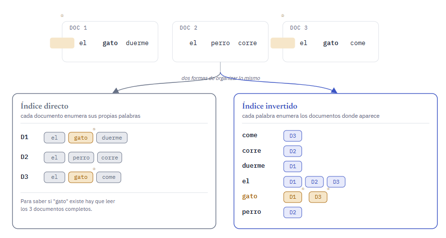
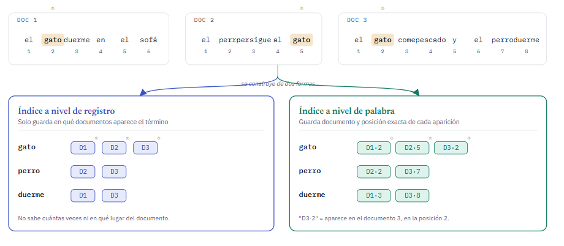

### indice Invertido

Es una estructura de datos que se usa para recuperar informacion de documentos o paginas web estan compuestas por : 

- Terminos especificos
- Conjunto de terminos

En esta estructura el indice esta compuesto por terminos (palabras) y cada una de estas apunta a una lista de documentos o paginas web que contienen este termino

### Donde se usa este tipo de estructura?

- Motores de busqueda
- Sistemas de bases de datos
- Aplicaciones que requieren una busqueda de texto eficiente

### Caracteristicas para reconocer un indice invertido

- Busquedas eficientes debido a que cada termino esta indexado 
- Actualizaciones rapidas 
- Flexibilidad ya que puede operar con consultas booleanas o de proximidad
- Compresion debido a que se pueden reducir los requisitos de almacenamiento 
- Compatibilidad con varios idiomas
- Admite derivacion y expansion de sinonimos

### Ejemplo indice invertido

### Tipos de indices invertidos

#### A nivel de registro

Esta contiene una lista de referencias a documentos para cada palabra

#### A nivel de palabra

Esta tambien pero tambien contiene la posicion dentro del documento, esta necesita mas procesamiento y espacio

### Pasos para crear un indice invertido

- Obtener documento = Eliminar palabras vacias como : yo , el , nosotros, es, una
- Derivacion de la palabra raiz = Por ejemplo si buscamos gato, queremos un documento con respecto a eso pero en el doc se encuentra como gatos o catty en lugar de gato, entonces para relacionar estas palabras, cortamos una parte de cada palabra para poder tener la raiz, hay una herramienta que hace esto que es porter stemmer
- Registrar id de documentos = Si la palabra ya esta presente , agregamos referencia del documento al indice, de lo contrario se crea una nueva entrada,

### Ejemplo con codigo

`\IndiceInvertido.java`
